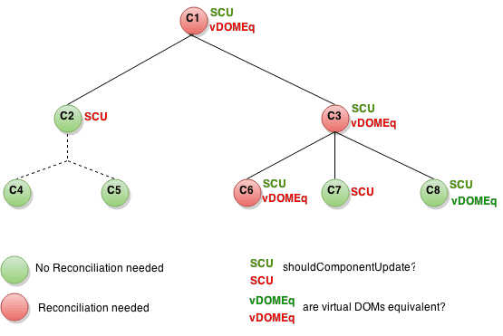

# RN环境配置
参考官网https://reactnative.cn/docs/getting-started.html

RN文件目录结构：
`
|--ReOrientWM
 |-- RN
 |-- ios
 |-- index.js
 |-- package.json
 |-- node_modules
 |-- src
 |-- libs
 `

# RN基础
## 1. props(属性)
大多数组件在创建时就可以使用各种参数来进行定制。用于定制的这些参数就称为props。
## 2. state(状态)
我们使用两种数据来控制一个组件：props和state。props是在父组件中指定，而且一经指定，在被指定的组件的生命周期中则不再改变。对于需要改变的数据，我们需要使用state。

* 一切界面变化都是状态state变化
* state的修改必须通过setState()方法
    * this.state.likes = 100; // 这样的直接赋值修改无效！
    * setState 是一个 merge 合并操作，只修改指定属性，不影响其他属性
    * setState 是异步操作，修改不会马上生效

# 原生模块
https://reactnative.cn/docs/native-modules-ios/
## rn to native
###OC
RCTBridgeModule
RCT_EXPORT_MODULE
RCT_EXPORT_METHOD
RCT_REMAP_METHOD

### 方法支持的参数类型：标准 JSON 类型、RCTResponseSenderBlock
`RCTConvert`类支持的的类型

### Swift
RCT_EXTERN_MODULE
RCT_EXTERN_METHOD
RCT_EXTERN_REMAP_MODULE

### 组件常量
- (NSDictionary *)constantsToExport
const RCTDatePickerIOSConsts = 组件.Constants

## native to rn

# 原生UI组件
RCTViewManager
RCT_EXPORT_MODULE()
-(UIView *)view

# 性能监控
## 调试工具
1. React Native调试面板 pref monitor
2. Instruments

## 性能指标
1. JS 帧率(JavaScript 线程)
2. UI 帧率(主线程)

shouldComponentUpdate 的作用
这是一个组件的子树。每个节点中，SCU 代表 shouldComponentUpdate 返回的值，而 vDOMEq 代表返回的 React 元素是否相同。最后，圆圈的颜色代表了该组件是否需要被调停。

节点 C2 的 shouldComponentUpdate 返回了 false，React 因而不会去渲染 C2，也因此 C4 和 C5 的 shouldComponentUpdate 不会被调用到。
对于 C1 和 C3，shouldComponentUpdate 返回了 true，所以 React 需要继续向下查询子节点。这里 C6 的 shouldComponentUpdate 返回了 true，同时由于渲染的元素与之前的不同使得 React 更新了该 DOM。
最后一个有趣的例子是 C8。React 需要渲染这个组件，但是由于其返回的 React 元素和之前渲染的相同，所以不需要更新 DOM。
显而易见，你看到 React 只改变了 C6 的 DOM。对于 C8，通过对比了渲染的 React 元素跳过了渲染。而对于 C2 的子节点和 C7，由于 shouldComponentUpdate 使得 render 并没有被调用。因此它们也不需要对比元素了。

# 什么是RN
# RN与原生的简单代码实战例子 rn->native、native->rn
## 原生模块
## 列表Demo
# React简介、RN交互的原理
## RN交互流程
## RN源码浅析
## 延伸到RN性能、线程