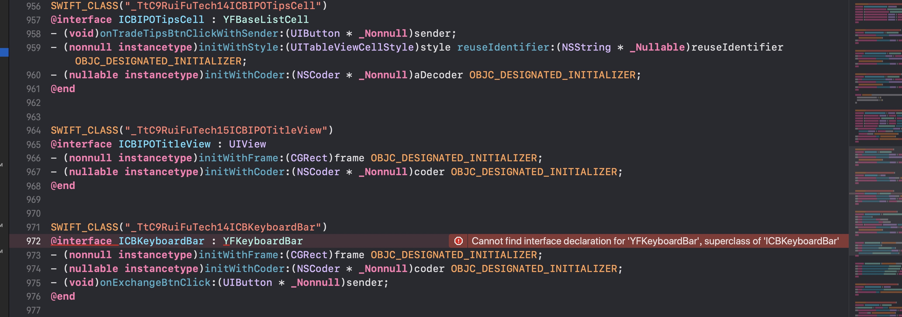
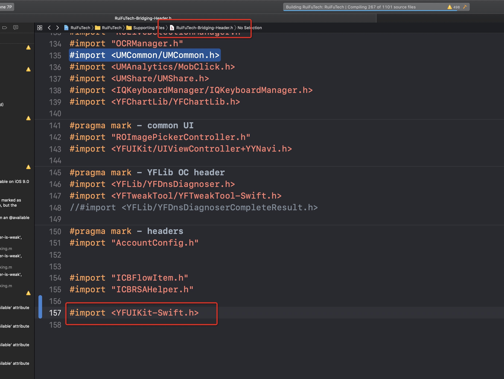

# 异常案例

工程创建 ICBKeyboardBar类继承于第三方YFUIKit framework的YFKeyboardBar
（ICBKeyboardBar、YFKeyboardBar）均为swift
出现桥接文件编译问题

stackoverflow论坛的类似问题：https://stackoverflow.com/questions/33809938/swift-error-cannot-find-interface-declaration-for-skscene-superclass-of

在工程的oc->swift桥接文件添加该framework的swift->oc桥接文件解决

总结：