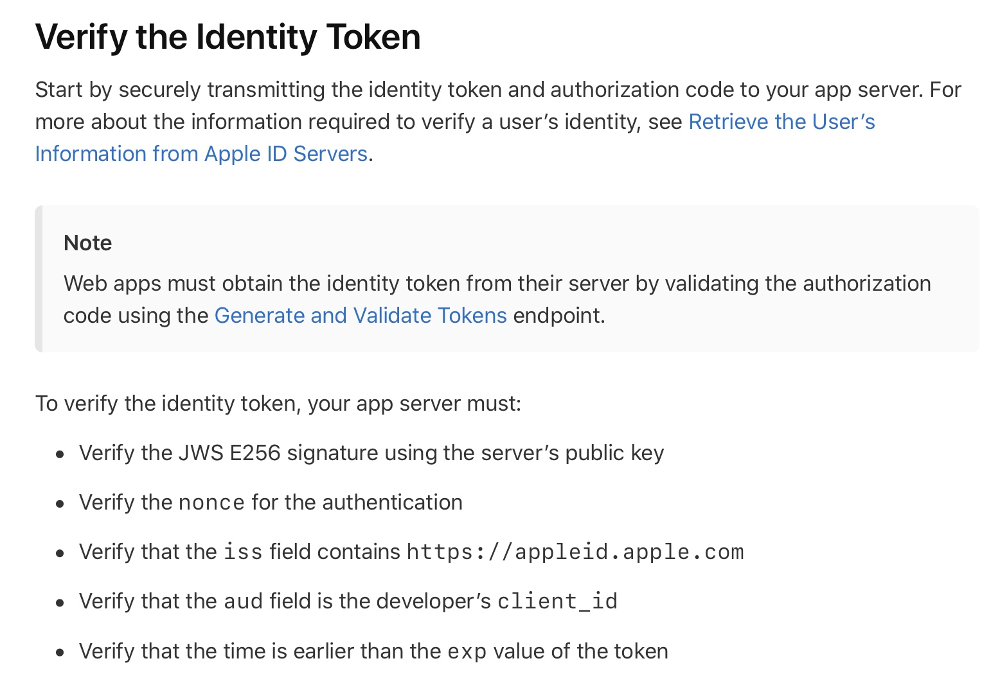
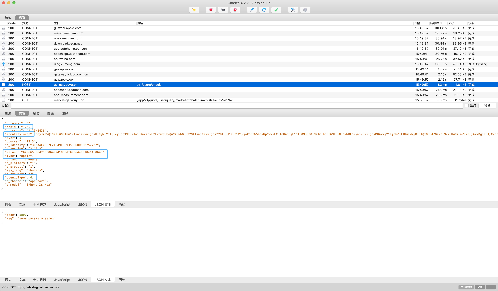

# #Sign In With Apple后端接入
* 背景：Apple要求所有使用第三方登录的 App 都必须接入 Sign In with Apple。
* 需求：有鱼当前只需苹果设备支持Sign in with Apple。

##苹果设备后端逻辑
步骤：
1. 从app获取`identityToken`
2. 从苹果服务器获取公钥[公钥官方文档](https://developer.apple.com/documentation/sign_in_with_apple/fetch_apple_s_public_key_for_verifying_token_signature)
3. identity token的5点验证，详情看[验证token官方文档](https://developer.apple.com/documentation/sign_in_with_apple/sign_in_with_apple_rest_api/verifying_a_user)
4. `identityToken`decode获取用户相关信息
5. 登录/注册业务


identityToken案例：


```
有鱼股票client_id：com.RuiFuTech.Financial
```
##需调整接口：/users/check
> 1. `value`对应用户唯一标识
2. `appid`添加类型`12`
3. `type`添加类型`apple`
4. `openidType`字段添加类型`4`
5. 添加字段`identityToken`





###### 注：identityToken是[JWT](https://jwt.io/)格式，各种语言都有开源库。
