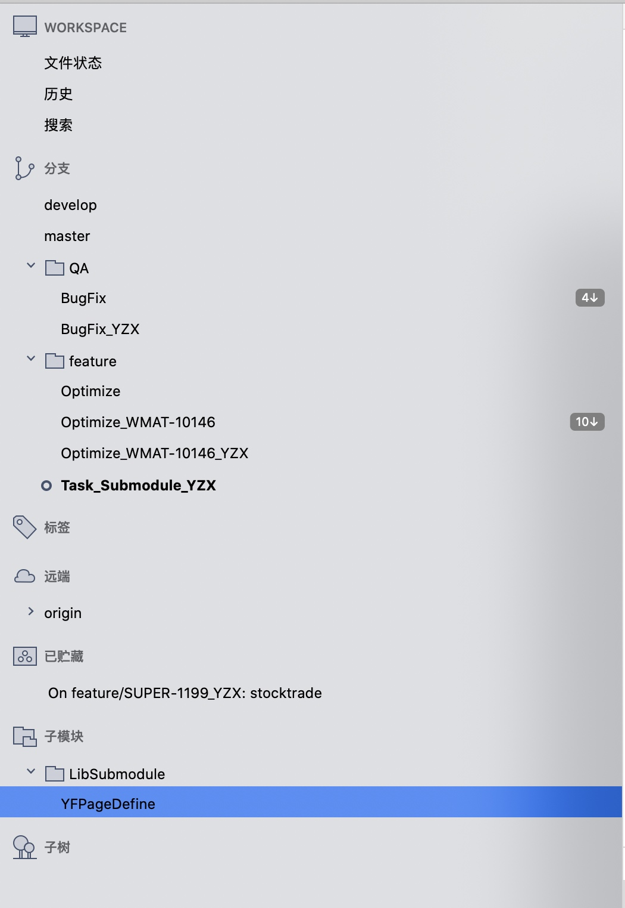
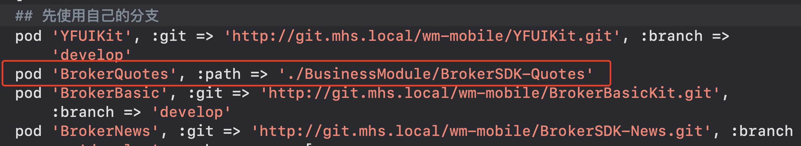
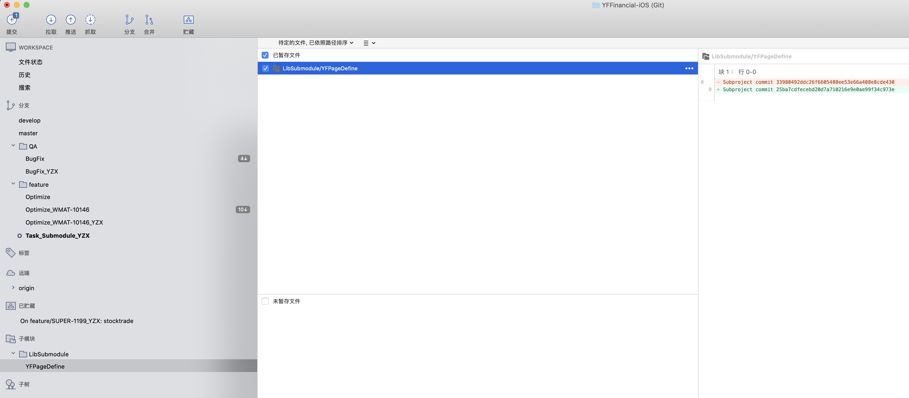
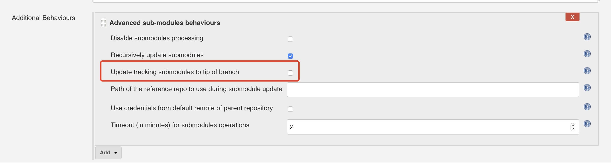
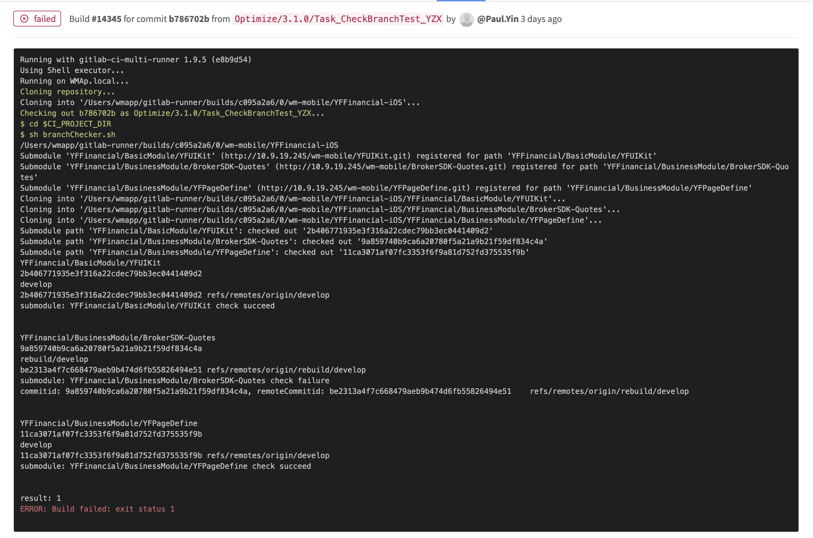
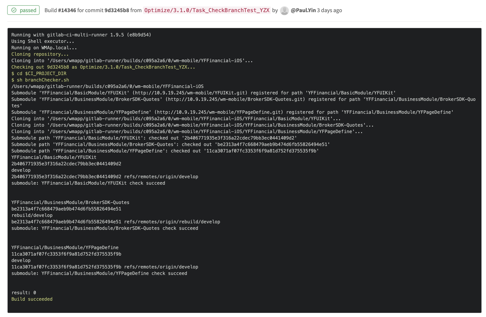

# git submodule概述

## 背景
开发过程中经常遇到需要改子模块的代码，当前工作流程：
* 方式1. 在主工程修改代码并验证 -> 把代码挪到子模块仓库中提交 -> 子模块提交merge并合并 -> 主工程执行pod update -> 提交主工程更新子模块代码版本merge
* 方式2. 在子模块demo修改代码 -> 子模块提交merge并合并 -> 主工程执行pod update -> 验证修改 -> 提交主工程更新子模块代码版本merge

以上为修改单个子模块情况，同时修改多个时，难度成倍增长。

## 给主工程添加Submodule
 我们可以看到目录下/LibSubmodule/YFPageDefine 有子模块的git版本配置文件。重定向到 SomeProject/.git/modules/LibSubmodule/YFPageDefine目录下。
 也可以通过sourcetree看到子模块创建成功

后续我们就可以通过子模块的版本管理愉快的push以及pull代码了！
 
 ```
git submodule add http://10.9.19.245/wm-mobile/YFPageDefine.git LibSubmodule
 ```
 
## 使用development Pods方式依赖Submodule

上述以BrokerQuotest为例
若依赖整个BrokerQuotes，那直接path指向BrokerQuotes源码path。
若仅需依赖BrokerQuotes部分subspec，可使用podspec来管理。


## 主工程修改submodule并提交
通过主项目打开子模块的版本控制 -> 正常修改、commit、push后 -> 我们会看到主工程自动生成了一个Subproject commit id，这个值就是当前主工程的子模块库当前的代码版本



## 关于子模块代码同步
clone会更新子模块:
git clone --recurse-submodules https://github.com/chaconinc/MainProject
git clone --remote --recurse-submodules https://github.com/chaconinc/MainProject

会更新子模块:
git submodule update --init --recursive
git submodule update --remote --init --recursive

### git submodule与SourceTree开发流程
* 直接在主工程上修改代码，子模块代码在development pod中，可以直接修改
* 修改完成主工程提交commit，SourceTree会提醒子模块有代码需要提交，提交完子模块。
* 提交子模块代码后，主工程自动生成子模块代码版本并commit
* 合并代码需先合并子模块代码，再合并主工程代码

需要注意：
1. 子模块版本修改变得十分简单，若发现子模块版本发生变更，请一定要确认代码版本是否正确。
2. 注意点：修改了子模块，需要check对子模块Demo工程的影响


## Submodule分支依赖管理

### 背景
使用submodule给使主工程修改子模块代码版本变得十分方便，只需修改子模块commitid即可。而code reviewer却很容易忽略掉这一行极其重要的代码修改，同时commitid的diff会让code reviewer摸不着头脑，究竟改了什么？这个submodule的代码是否已经提交了？是否符合git flow分支管理？


### 配置依赖分支
* 给submodule设置分支依赖
git config -f .gitmodules submodule.SubmoduleName.branch branchName

### 更新submodule的两种方式
#### 1. 使用仓库记录的submodule代码版本
git submodule update --init --recursive
#### 2. 使用远端依赖分支的submodule代码版本
git submodule update --remote --init --recursive



#### 作用
备注：开发的2个阶段：开发阶段、发布阶段
##### 1. 打包
* 方式1为版本管理方式，ci clone主工程后，以仓库记录的submodule代码版本进行更新、打包。 一般用于发布阶段
* 方式2为分支管理方式，ci clone主工程后，以远端依赖分支的submodule代码版本进行更新、打包。 一般用于开发阶段

### giblab-ci分支检测
异常案例


正常案例


### submodule分支依赖方式管理（不适用于Sourcetree）
* 给submodule设置分支依赖
git config -f .gitmodules submodule.SubmoduleName.branch branchName
* 更新submodule的时候需要添加--remote
git submodule update --remote --init --recursive
 

## 参考资料
官方文档：https://git-scm.com/book/zh/v2/Git-工具-子模块


