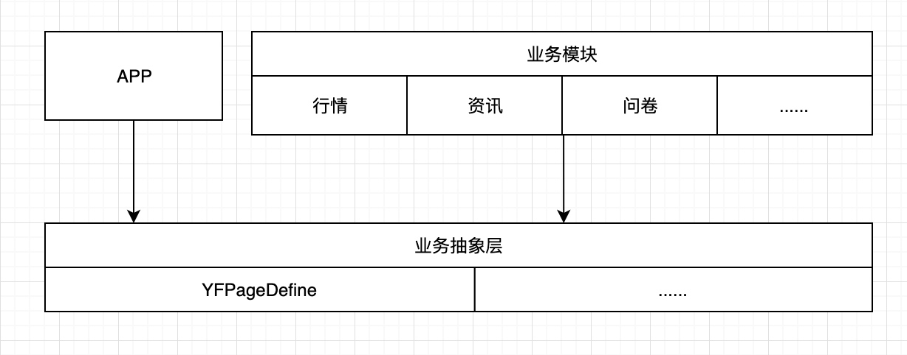
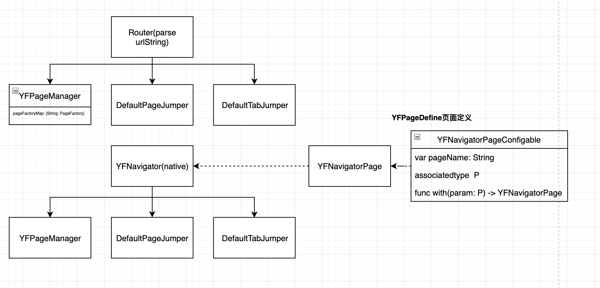

# YSAPage开发流程

## 1. 背景
1. 多业务库页面依赖问题，导致当前业务库的网状依赖
2. 页面重构不能快速支持线上重构与旧代码的切换（RN\Native）
    - native端页面跳转指定了具体的VC
    - router的url指定了具体的VC，无法进行动态配置

## 2. 设计目的
1. 统一页面定义，各业务模块的页面解耦，不再互相依赖，形成网状依赖
2. App的页面跳转使用统一API，支持页面跳转动态配置

## 3. 组件结构介绍
### 3.1 组件库结构图


### 3.2 YFPageManager 与Router、Jumper关系



### 3.3 YFNavigatorPage\YFNavigatorPageConfigable 介绍
上图


## 4. 定义规范说明
## 4.1 编写文档：
https://docs.google.com/spreadsheets/d/1Fa669LwD1F1OfVUBWDgLvh99iyaVSlc8i6pap7ggksg/edit#gid=1097861093
原有路由协议文档：
 http://confluence.mhs.local:8090/pages/viewpage.action?pageId=382828608
 原有文档参数描述较齐全可供参考。

### 4.2 定义一个页面
#### 4.2.1 需要传参的页面
```
// 定义pageName
public static let stockdetail = "stockdetail"

// 定义pageProtocol
public protocol YFStockDetailConfigProtocol: JumpParameters {
    var stockCode: String { get } //股票代码
    var marketCode: String { get } //市场代码
    var stockType: String? { get } //股票类型
    var stockName: String? { get } //股票名字
    var isBottom: Bool {get} //是否滑到底部
    var tab: String? {get} //对应的个股底部tab
}

/// 依赖绑定
public struct YFStockDetailPage: YFNavigatorPageConfigable {
    
    static public var pageName: String = BrokerQuotesPageKey.stockdetail
    public typealias P = YFStockDetailConfigProtocol
}

// 定义page
public static let stockDetail = YFStockDetailPage.self
```

#### 4.2.2 不需要传参的页面
```
// 定义pageName
public static let marginlist = "marginlist"

// 定义page
public static let marginList = YFNavigatorPage(pageName: BrokerQuotesPageKey.marginlist)
```

### 4.3 页面实例工厂支持
```
// 在具体业务模块实现页面工厂
extension YFMarketMarginListViewController: JumpPageViewController {
    public static func getJumpPageViewController(_ params: JumpParameters?) -> UIViewController? {
        return YFMarketMarginListViewController()
    }
}

// YFPageManager注册页面
YFPageManager.shared.registPage(pageName: BrokerQuotesPageKey.marginlist, page: YFCommonJumpPageGetter(pageType: YFMarketMarginListViewController.self))


// 在具体业务模块实现页面工厂
class StockDetailFactory: JumpPageViewController {
    
    public static func getJumpPageViewController(_ params: JumpParameters?) -> UIViewController? {
    // 根据传参判断跳转个股详情/指数详情        
    }
}

// 注册到YFPageManager
YFPageManager.shared.registPage(pageName: BrokerQuotesPageKey.stockdetail, page: YFCommonJumpPageGetter(pageType: StockDetailFactory.self))
```

#### 重构的页面与旧页面并行的情况
旧页面：OldPageFactory
新页面：NewPageFactory
YFPageManager.shared.registPage(pageName: pageName, page: OldPageFactory)
or
YFPageManager.shared.registPage(pageName: pageName, page: NewPageFactory)

业务调用接口不变：
// 获取页面
let vc = BrokerQuotesPage.marginList.viewController()
let vc = BrokerQuotesPage.stockDetail.with(param: stockModel).viewController()

// push页面
BrokerQuotesPage.marginList.push()
BrokerQuotesPage.stockDetail.with(stockDetailProtocol).push()


### 4.4 主工程配置、注册
```
//YSAAppInitializeService
//行情pod页面注册
BrokerQuotesPageRegister.registePages(pageManager: YSARouter.shared.pageManager)
NewsPageRegister.registePages(pageManager: YSARouter.shared.pageManager) 
……
```

## 5. 开发流程规范
### 5.1 开发一个页面
1. 编写文档
2. YSAPage仓库定义页面
3. 提交页面定义，避免多人协作的依赖阻塞
4. 实现对应的VC

### 5.2 配合git submodule便捷开发

引入gitsubmodule快捷管理页面，使用见gitsubmodule文档

