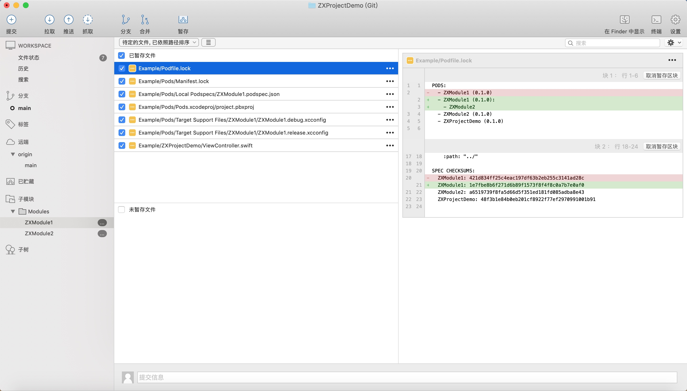
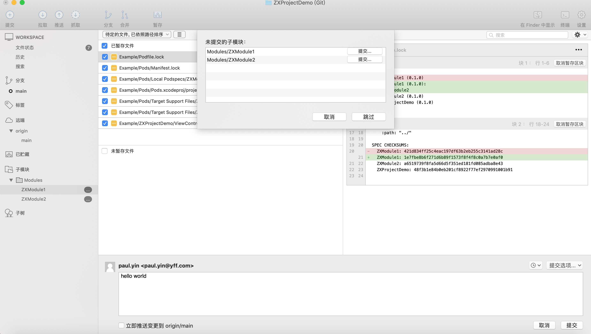
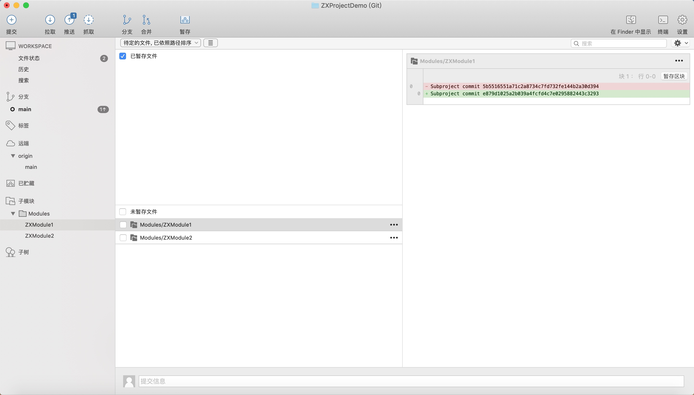

# 组件化 - 使用"git submodule" + "development pod"集成组件

## 背景
当前公司模块化代码集成使用私有库方式。
### 存在以下问题：
1. **同步成本高，易错**。每次修改完子模块时，主工程都要执行pod update同步修改。过程十分繁琐，经常忘记同步导致修改代码没打进包里。
2. **实际开发体验差**。很多时候，大家都在主工程直接修改子模块代码，修改验证之后，把修改逐一迁移到子模块仓库再提交。
3. **复杂场景开发复杂度指数递增**。若需要修改2个或以上存在依赖的子模块时，代码提交、同步的复杂度是难以想象的。

### 期望:
快速修改、快速同步。

## 前言
### 1.git submodule介绍：
https://git-scm.com/book/zh/v2/Git-工具-子模块
### 2.development pod介绍：
在Podfile使用path方式集成的子模块。
```
pod 'ZXModule1', :path => '../Modules/ZXModule1' //本地库
pod 'ZXModule1', :git => 'http://private/ZXModule1.git' //私有库
pod 'ZXModule1'  :git => 'http://public/ZXModule1.git'//三方库
```

## "git submodule" + "development pod"集成

[示例工程](https://github.com/ZXWin26/ZXProjectDemo.git)
### 1. 添加子模块依赖
角色：主工程（ZXProjectDemo）、子模块s(ZXModule1、ZXModule2)

```
git submodule add https://github.com/https://github.com/ZXWin26/ZXProjectDemo.gitZXModule1
git submodule add https://github.com/ZXWin26/ZXModule2.git Modules/ZXModule2
git submodule update --init --recursive
```
### 2. 使用"development pod"本地库方式依赖子模块本地仓库
主工程使用本地库方式集成ZXModule1、ZXModule2
```
  pod 'ZXModule1', :path => '../Modules/ZXModule1'
  pod 'ZXModule2', :path => '../Modules/ZXModule2'
```

## 使用案例：
在一个工程里，同时修改主工程、多个子模块。

### 1.代码修改
现在我们同时修改ZXProjectDemo、ZXModule1、ZXModule2
并且同时向3个仓库进行代码修改，修改以下几点：
1. ZXModule2添加函数hello。
2. ZXModule1添加依赖ZXModule2，ZXModule1添加函数hello，并且调用依赖库ZXModule2新增函数hello。
3. ZXProjectDemo调用ZXModule1新增函数hellow

注意：ZXModule1添加依赖库后主工程需要pod install添加依赖

### 2.代码提交（以下使用SourceTree作为展示便于理解）
以下是主工程的代码调整


当我们commit时，Git submodule会提示我们，需要先commit submodule diff。


当我们提交完submodule仓库代码后，主工程的依赖也更新了，有以下diff。


以上完成在一个工程里，同时修改主工程、多个子模块代码，同时提交主工程、多个子模块代码的案例。

## 后续还会介绍:
1. "submodule+本地库"集成方式，结合jenkins进行CI/CD管理方案。
2. "submodule+本地库"集成方式，需要注意什么。