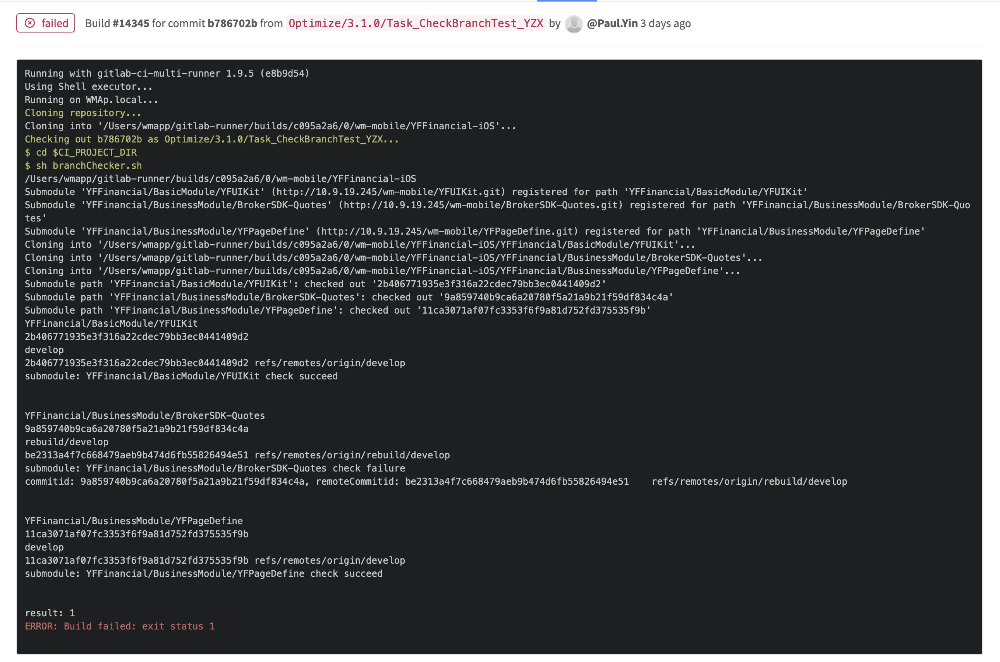
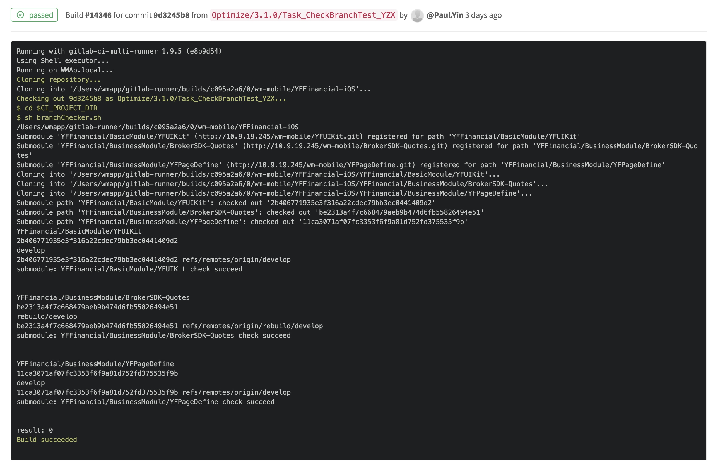

# Submodule分支依赖管理

## 背景
使用submodule给使主工程修改子模块代码版本变得十分方便，只需修改子模块commitid即可。而code reviewer却很容易忽略掉这一行极其重要的代码修改，同时commitid的diff会让code reviewer摸不着头脑，究竟改了什么？这个submodule的代码是否已经提交了？是否符合git flow分支管理？


## 配置依赖分支
* 给submodule设置分支依赖
git config -f .gitmodules submodule.SubmoduleName.branch branchName

## 更新submodule的两种方式
### 1. 使用仓库记录的submodule代码版本
git submodule update --init --recursive
### 2. 使用远端依赖分支的submodule代码版本
git submodule update --remote --init --recursive
### 作用
备注：开发的2个阶段：开发阶段、发布阶段
#### 1. 打包
* 方式1为版本管理方式，ci clone主工程后，以仓库记录的submodule代码版本进行更新、打包。 一般用于发布阶段
* 方式2为分支管理方式，ci clone主工程后，以远端依赖分支的submodule代码版本进行更新、打包。 一般用于开发阶段


## giblab-ci分支检测

异常案例


正常案例



## giblab-ci.yml踩坑
在gitlab-ci.yml文件上配置build脚本，不要像以下代码把脚本一行行贴上去，可能会导致ci执行结果与直接使用shell执行结果不一，例如：if [ -z "$CI_PROJECT_DIR" ]这句代码，执行结果异常，但是使用if [ -z $CI_PROJECT_DIR ]结果却是正常的。
```
job:
    stage: build
    when: always
    script:
        - cd $CI_PROJECT_DIR
        - echo abc
        - if [ -z "$CI_PROJECT_DIR" ]; 
        - then 
        - echo empty project_dir
```