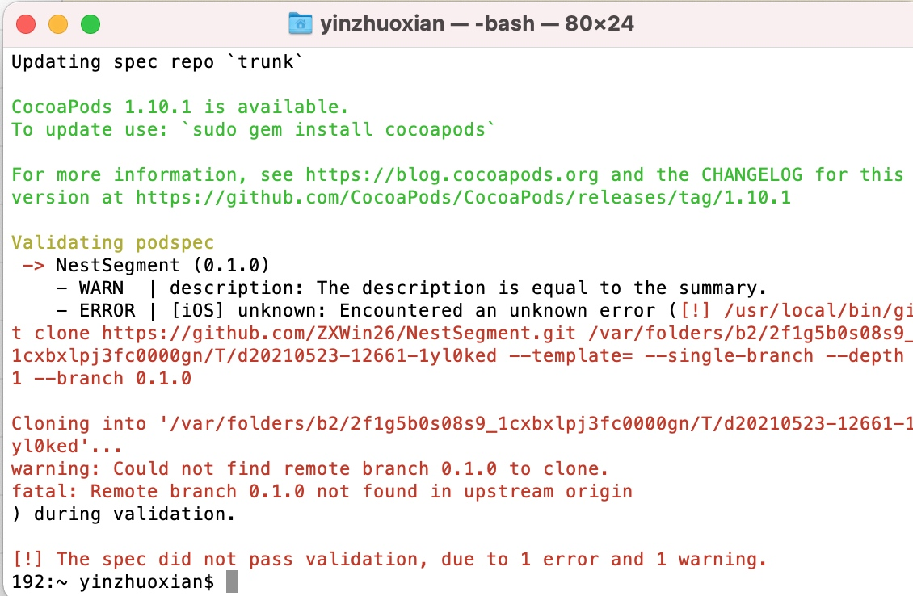

# Gig tree
1. 把文档库使用Github托管
2. 学习travis-ci，优化NestSegment的部署标签、版本标签
3. 调整podspec以及README内容保持一致
4. PageDefine github demo项目
5. PageDefine简书
6. 引出Git submodule
7. NestSegment代码优化，实现version 1.0 
8. NestSegment简书
9. 把项目注册到cocoapod

# 2021/05/23

## 项目标签自动生成工具：
https://shields.io/category/build

## 开源库
### 注册cocoapods
pod trunk register orta@cocoapods.org 'Orta Therox' --description='macbook air'

### 上传到cocoapod
    pod trunk push /Users/yinzhuoxian/NestSegment/NestSegment.podspec 
需要完成第一个版本，打Tag后再上传到cocoapods

## Page抽象层
1. 把代码抽象层组件抽离出来，搞成pod
2. Submodule demo添加Page抽象层作为demo例子。
3. 修改Page文档，放到简书，引出Submodule
4. 优化Submodule简书，引出Submodule分支管理
5. Submodule分支管理、gitlab-ci脚本
6. 未来展望，了解swiftlint