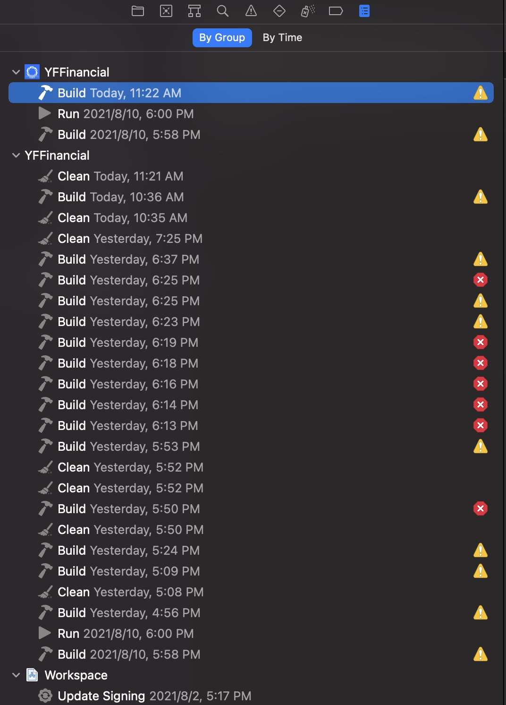
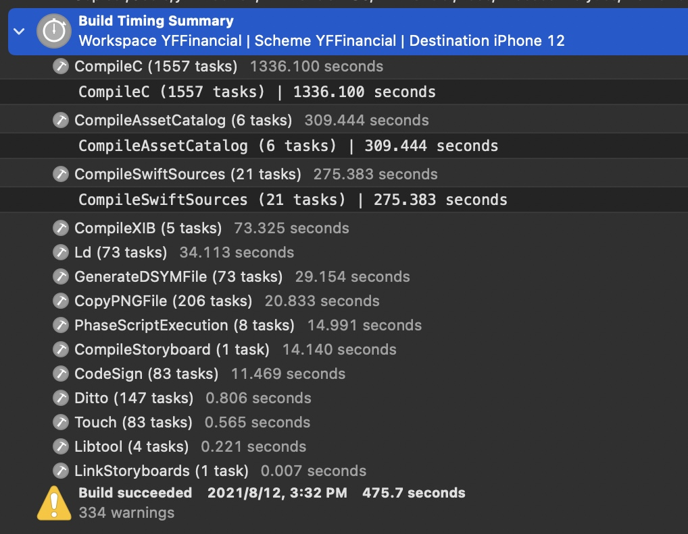
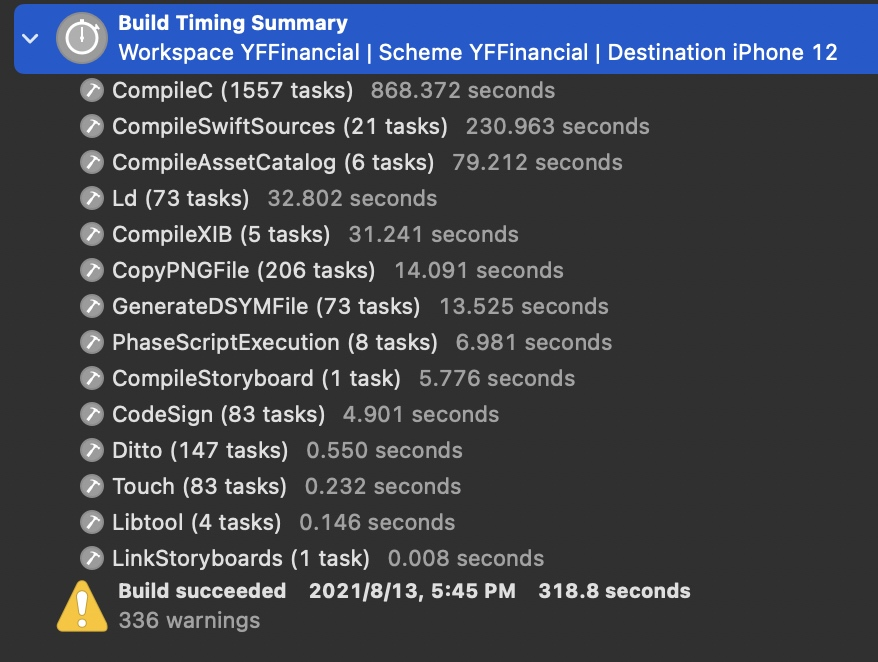
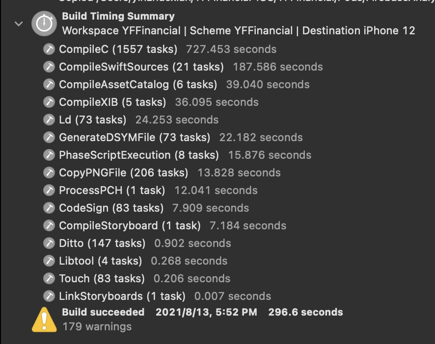
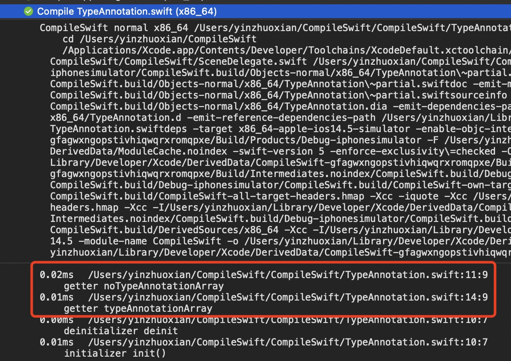
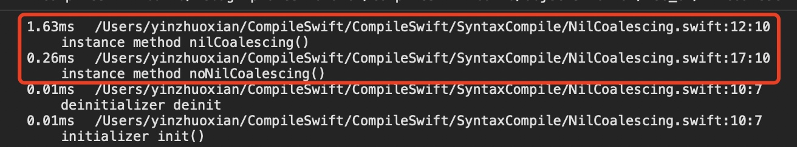
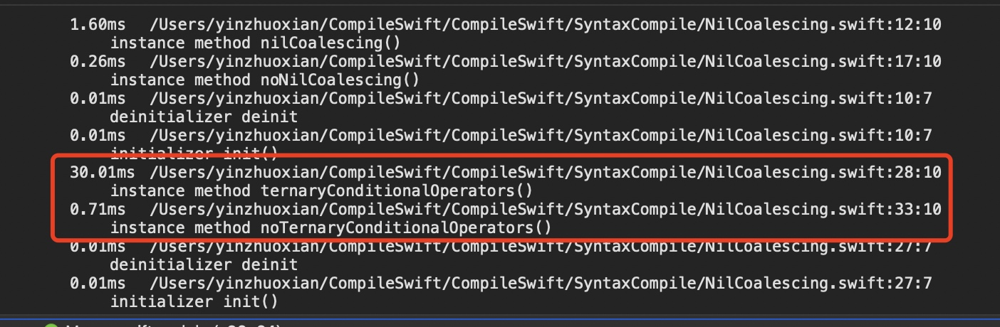
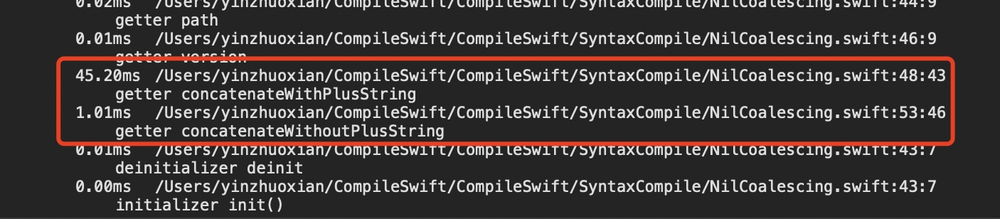
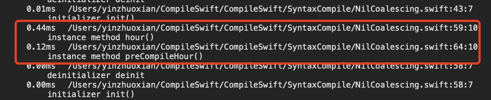

# swift编译优化

## 编译时间分析
### 1.第三方工具：https://github.com/RobertGummesson/BuildTimeAnalyzer-for-Xcode/issues/88
在xcode12.5上统计数据不准确

### 2.xcode直接导出Build日志
#### 2.1.导出编译日志
选中某一个Build，在导航栏选中All Messages，点击右边Export按钮


#### 2.2.使用Xcode Timing Summary
`Product->Perform Action->Build With Timing Summary`

#### 2.3.编译流程
1. 编译前准备（CreateBuildDirectory，读取配置（Build target YFFinancial of project YFFinancial with configuration Debug），WriteAuxiliaryFile，ProcessProductPackaging，PhaseScriptExecution）
2. 主工程swift代码编译
    * 编译swift源文件 CompileSwiftSources
    * 预编译OC桥接文件 PrecompileSwiftBridgingHeader
    * 编译项目源文件 CompileSwift
    * MergeSwiftModule normal x86_64 (in target 'YFFinancial' from project 'YFFinancial')
    * Ditto 生成swift各种头以及源文件（.swiftdoc, .swiftmodule, .swiftsourceinfo, .YFFinancial-Swift.h）
3. 编译OC等文件 CompileC
4. CpResource、CopyStringsFile、CopyPlistFile、CopyPNGFile、CompileXIB、CompileStoryboard、CompileAssetCatalog、LinkStoryboards、ProcessInfoPlistFile、WriteAuxiliaryFile、PhaseScriptExecution
5. 拷贝framework
6. CodeSign
7. Build target Pods-YFFinancial of project Pods with configuration Debug
8. 类似上述步骤2-6编译主工程文件。
9. 结束

#### 2.4.当前APP耗时分布
SuperApp编译时间概要


由于执行编译任务会并行执行，因此实际耗时比概要时间短。
总耗时475.7s，
1. CompileC：1336.1s
2. CompileAssetCatalog 309.4s
3. CompileSwiftSources 275.3s
4. compileXIB 73.3s

### 编译优化
结合项目当前实际情况，应先着手OC文件的编译优化。
OC、C文件编译，可参考微信团队踩坑：
https://mp.weixin.qq.com/s/-wgBhE11xEXDS7Hqgq3FjA
https://tech.meituan.com/2021/02/25/swift-objective-c.html

#### 存在问题
##### 优化头文件引用问题
OC头文件导入

##### 使用pch预编译头文件
编译环境：x86，优化前


编译环境：x86，优化后


CompileC时间减少，ProcessPCH增加。

##### CompileC


##### swift编译优化
build settings -> other swift flag添加-Xfrontend -debug-time-function-bodies查看swift文件编译时间。

###### 1. 类型推断

```
let noTypeAnnotationArray = ["a", "b", "c", "d", "e", "f", "g"]
    
let typeAnnotationArray: [String] = ["a", "b", "c", "d", "e", "f", "g"]
```


###### 2. 减少使用 ?? 解包运算符

```
func nilCoalescing() -> String {
        let output: String? = "a"
        return output ?? ""
    }
    
    func noNilCoalescing() -> String {
        let output: String? = "a"
        if let outputString = output {
            return outputString
        } else {
            return ""
        }
    }
```

###### 3. 减少使用三目运算符

```
func ternaryConditionalOperators() -> String {
        let count = Int.random(in: 0...1)
        return count == 0 ? "0" : "1"
    }
    
    func noTernaryConditionalOperators() -> String {
        let count = Int.random(in: 0...1)
        if count == 0 {
            return "0"
        } else {
            return "1"
        }
    }
```


###### 4. 减少使用字符串拼接

```
let path: String = "common"
    
let version: String = "v1"
    
var concatenateWithPlusString: String {
    let result = path + version
    return result
}
    
var concatenateWithoutPlusString: String {
    "\(path)\(version)"
}
```

###### 5. 元数据预编译


```
func hour() -> Int {
        let hour: Int = 60 * 60
        return hour
    }
    
    func preCompileHour() -> Int {
        let preCompileHour: Int = 3600
        return preCompileHour
    }
```


## 减少AppStroe安装包大小
1. 苹果提供的On-Demand Resources方案。资源会存在苹果服务器。
2. 没使用xcassets管理的资源图片需要压缩。
