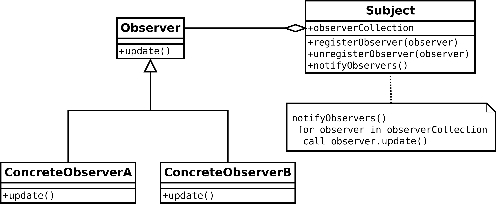

# 异步编程
# Rxswift响应式编程
Rxswift是一套解决异步编程问题的API，使用观察者模式和迭代子模式，基于函数式编程的思想。
设计模式的综合运用：Observer、Builder、Iterator

## 观察者模式

RxSwift对应角色：
Subject -> BehaviorSubject
observerCollection -> observers
registerObserver -> subscribe
unregisterObserver -> synchronizedUnsubscribe
notifyObservers -> on(event:)
Observer -> AnonymousObserver

## 建造者模式

RxSwift对应角色：
Product -> Producer（Operator基类）
ObservableType extensions -> Director
ConcreteBuilder -> 创建型（Create、Defer、From）、变换型（Buffer、Map、GroupBy）、过滤型（Filter、Take）、关联型（And、Join、Merge）等等
通过点语法建造Obserable
```
Observable.repeatElement("🔴")
          .take(3)
```


## 关键类：
基本类型定义：
ObservableType 可监听类型
SchedulerType  调度器类型
ObserverType   观察者类型
Disposable     可解除监听/订阅类型

### 关键类：Operators
作用：链接操作，链中的每个Operator都会修改由前一个Operator产生的Observable。类似建造者模式，建造一个符合需求的Observable。

#### 运算符分类
运算符分类：http://reactivex.io/documentation/operators.html#categorized

#### 如何选择恰当的Operator？
运算符决策树：http://reactivex.io/documentation/operators.html#categorized

#### Sink
RxSwift每个Operator都有对应的Sink子类，其功能为订阅信号源时给ObservableType、SchedulerType、ObserverType、Disposable 4个对象构建依赖关系。

创建型Operator绑定的逻辑案例：
```
/// RepeatElement Operator构建依赖
override func run<Observer: ObserverType>(_ observer: Observer, cancel: Cancelable) -> (sink: Disposable, subscription: Disposable) where Observer.Element == Element {
        let sink = RepeatElementSink(parent: self, observer: observer, cancel: cancel)
        let subscription = sink.run() // 绑定

        return (sink: sink, subscription: subscription)
    }
    
/// RepeatElementSink运算符调度逻辑
func run() -> Disposable {
        return self.parent.scheduler.scheduleRecursive(self.parent.element) { e, recurse in
            self.forwardOn(.next(e))
            recurse(e)
        }
    }
```

转换型Operator案例：
```
/// GroupBy Operator构建依赖
override func run<Observer: ObserverType>(_ observer: Observer, cancel: Cancelable) -> (sink: Disposable, subscription: Disposable) where Observer.Element == GroupedObservable<Key,Element> {
        let sink = GroupBySink(parent: self, observer: observer, cancel: cancel)
        return (sink: sink, subscription: sink.run())
    }
    
func run() -> Disposable {
        self.refCountDisposable = RefCountDisposable(disposable: self.subscription)
        
        self.subscription.setDisposable(self.parent.source.subscribe(self))
        
        return self.refCountDisposable
    }
```


Operators
Single
Subject
Scheduler


# PromiseKit