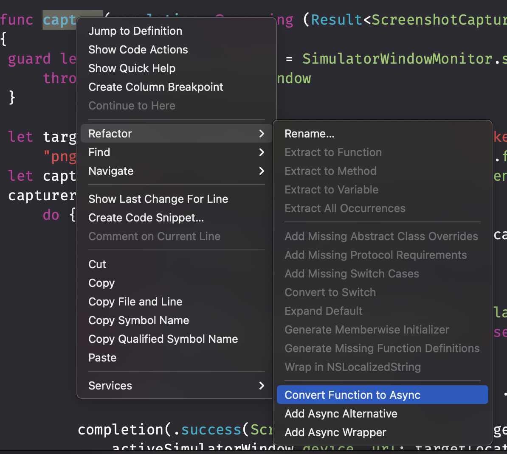

# swift async await

## async-await
1. Task（异步任务）
2. async-await与try-catch使用替代旧方式block - Result<Success, Fail>方式
3. 异步代码重构async-await（）

### 使用async-await新特性3种过渡方案：
##### 1. 对于block - Result<Success, Fail>方式实现的代码可以使用官方转换器Refactor -> Convert Function to Async


##### 2. 使用async-await重写异步实现，原来API使用实现进行替换。
```
struct ImageFetcher {
    @available(*, renamed: "fetchImages()")
    func fetchImages(completion: @escaping (Result<[UIImage], Error>) -> Void) {
        Task {
            do {
                let result = try await fetchImages()
                completion(.success(result))
            } catch {
                completion(.failure(error))
            }
        }
    }


    func fetchImages() async throws -> [UIImage] {
        // .. perform data request
    }
}
```

##### 3. 基于原有实现，提供async-await方式API
主要涉及桥接方法`withCheckedThrowingContinuation`和`withCheckedContinuation`
```
struct ImageFetcher {
    @available(*, renamed: "fetchImages()")
    func fetchImages(completion: @escaping (Result<[UIImage], Error>) -> Void) {
        // .. perform data request
    }

    func fetchImages() async throws -> [UIImage] {
        return try await withCheckedThrowingContinuation { continuation in
            fetchImages() { result in
                continuation.resume(with: result)
            }
        }
    }
}
```

##### 

https://www.avanderlee.com/swift/async-await/


### 资源竞争（Data Race）

#### 资源竞争会导致表现
1. 与预期不一的行为
2. 内存损坏
3. 奇怪的测试结果
4. 怪异崩溃

#### 检测手段：Diagnostics -> Thread Sanitizer

#### 解决资源竞争问题
在一个队列访问资源
使用actor


https://www.avanderlee.com/swift/thread-sanitizer-data-races/