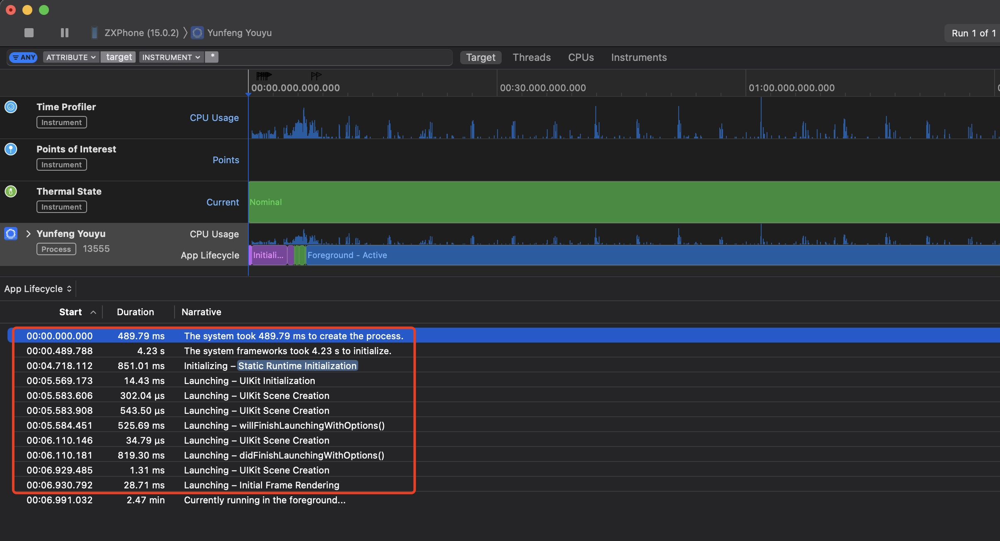
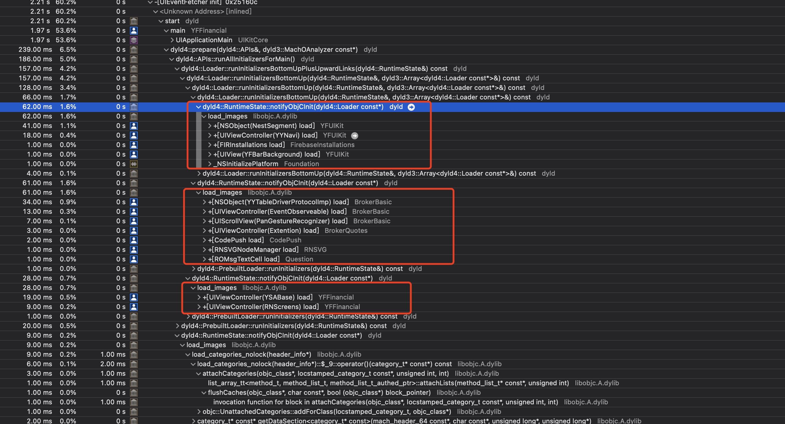
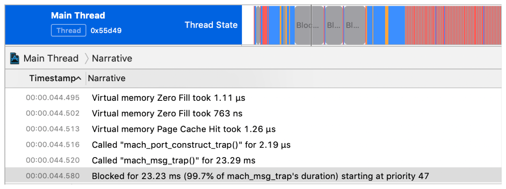
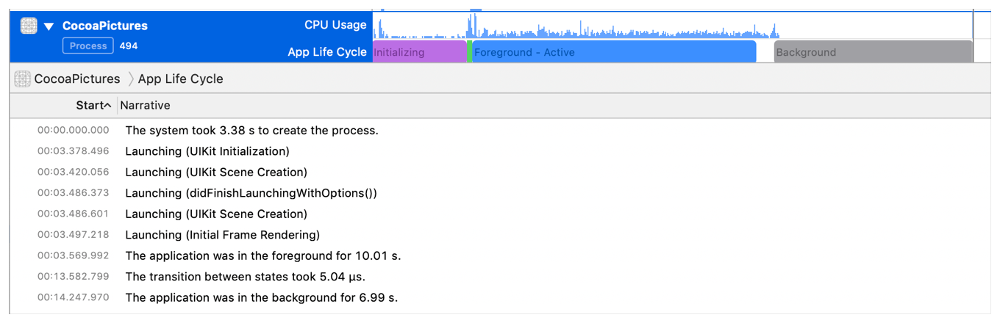
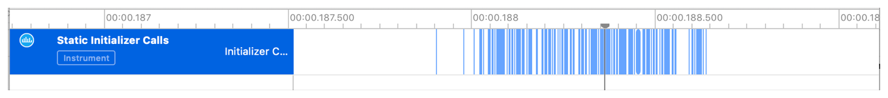
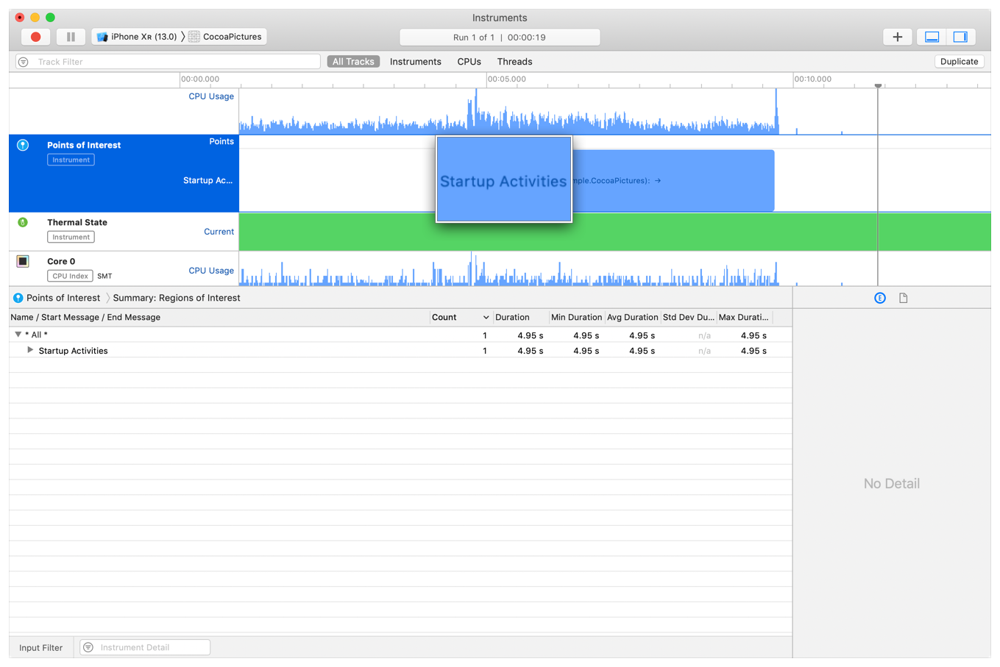

# 优化APP性能
https://developer.apple.com/documentation/xcode/improving-your-app-s-performance

## 通过使用持续改进周期来建模、测量和提升应用程序的性能。
通过科学地解决问题来规划和实施性能改进：
* 收集有关用户看到的问题的信息。
* 测量应用程序的行为，找出问题的原因。
* 计划一次版本修改以改善情况。
* 实施版本修改。
* 观察应用程序的性能是否有所提高。

优化APP体验的措施：
* 缩短应用程序启动时间可以改善用户体验，并减少iOS看门狗终止应用程序的次数。
* 减少总体内存使用会降低iOS在后台释放应用程序内存的可能性，并提高用户切换回应用程序时的响应能力。
* 减少磁盘写入可以提高应用程序的整体性能，提高响应速度，并减少用户设备存储的损耗。
* 降低挂起率和挂起持续时间可以提高用户对应用程序性能和响应的体验。
* 减少电池消耗和使用耗电设备功能使您的应用程序更加可靠。

## 收集应用程序当前性能的数据
使用Xcode Organizer可以查看启动时间、用户界面响应、写入存储器、内存使用和能耗的指标，以及磁盘写入、崩溃和能耗的诊断报告。
* 使用Xcode Organizer可以查看启动时间、用户界面响应、写入存储器、内存使用和能耗的指标，以及磁盘写入、崩溃和能耗的诊断报告。Organizer允许您按设备型号、应用程序版本和用户百分比细分测量值。有关更多信息，请参阅分析配送应用程序的性能。
* 使用MetricKit收集指标并将其记录在您自己的工具中。这些指标以直方图的形式记录一天中观察值的频率。MetricKit超越了organizer中显示的指标，包括平均像素亮度、蜂窝网络条件以及与应用程序中自定义OSSignpost事件相关的持续时间。
* 获取TestFlight测试人员关于他们使用应用程序测试版的体验的反馈。填写测试版的测试信息页面，并要求测试人员提供有关应用程序性能的反馈。包括电子邮件地址，以便测试人员可以报告他们的发现。
* 调查用户对应用程序发布版本体验的反馈。邀请用户通过电子邮件或应用程序内的专用界面发送反馈。询问他们使用该应用程序的经验，包括哪些应用程序运行良好，以及他们遇到的任何问题。

## 使用Instrument分析APP
使用Instrument分析应用程序，选择与您考虑的指标相关的评测模板：
* 无响应和挂起：使用Time Profiler。
* 内存问题：使用 Allocations and Leaks。
* 功耗问题：使用 Energy Log。
* I/O问题：使用File Activity。
* 网络相关问题：使用Network。

通过在设备上而不是模拟器上进行分析，您将获得更高的保真度测量。如果您收集的信息显示您的应用程序在特定类别或型号的设备上性能不佳，请在该设备上配置文件。
找出导致性能问题的代码，并制定改进计划。请记住，您的更改可能不会局限于特定的行或功能，您可能需要对应用程序进行重大的架构更改。例如，为了缓解同步下载网络资源引起的挂起，引入后台操作来处理联网（请参见后台下载文件），并在下载完成后在主线程上执行UI更新。

## 将更改的行为数据与原始数据进行比较


-------
 
# 启动优化


有鱼冷启动耗时，约7s。
热启动APP约3s。
其中加载动态库耗时最长。首屏渲染时间也较长，约1s

! profile的时间不是真实启动时间。



+load方法使用dispatch_once以及runtime methodswizzle性能不加，占用冷启动时间约130ms。
存在遍历所有OC类进行methodswizzle，此方式性能差。

## APP激活
APP激活为用户点击APP icon进入或者回到APP的过程。
激活包括启动和恢复。启动是指进程需要启动，恢复是指应用程序已经有一个进程处于活动状态，即使该进程已暂停。恢复通常要快得多，优化启动和恢复的工作也有所不同。即“冷启动”和“热启动”

## 使用MetricKit收集您APP的启动时间
MetricKit除了报告启动时间外，还报告恢复应用程序的时间。MXAppLaunchMetric包含前一天的启动和恢复时间直方图。

## APP启动时间分析
使用Instruments收集启动时堆栈的调用信息以及耗时。使用这些数据进行问题定位。
1. 使用Time Profile确认启动时执行的代码。
2. 使用Thread-State trace跟踪线程被激活和堵塞的次数，找到线程被堵塞的原因。

在不同情况下概述应用程序的启动时间，以了解这些因素如何影响体验。以下是一些需要测试的不同情况的示例：
* 打开设备，首次解锁，然后启动应用程序。
* 强制退出应用程序，然后启动它。系统将终止您的应用程序进程，并执行热启动。
* 如果您打开其他应用程序，然后启动您的应用程序，系统会部分退出您的应用程序及其依赖项，这反映了常见的用户操作流程。
* 使用一个非常大的应用程序-例如，一个可以使用许多图形资源或实时摄像机输入的应用程序-然后启动你的应用程序。系统可能会终止应用程序的已终止进程，这意味着系统需要在下一次启动期间查看应用程序的许多依赖项。




UIKit在主线程上绘制视图并处理用户事件，因此当应用程序完成启动时，线程必须处于可以绘制第一帧的状态。在Instruments thread trace，主线程运行或抢占的时间是它无法绘制视图或响应用户输入事件的时间。




要查看应用程序启动的其他视图，请使用Time Profile分析应用程序。应用程序生命周期时间线将应用程序启动期间的活动分为进程初始化、UIKit初始化、UIKit初始场景渲染和初始帧渲染。

## 减少对外部框架和动态库的依赖
在运行任何代码之前，系统必须查找并加载应用程序的可执行文件及其依赖的任何库。
动态加载程序（dyld）加载应用程序的可执行文件，并检查可执行文件中的Mach load命令，以查找应用程序所需的框架和动态库。然后，它将每个框架加载到内存中，并解析可执行文件中的动态符号，以指向动态库中的相应地址。
应用程序加载的每个附加第三方框架都会增加启动时间。虽然当用户安装应用程序时，dyld会在启动关闭中缓存大量这类工作，但启动关闭的大小以及加载后完成的工作量仍然取决于加载的库的数量和大小。通过限制嵌入的第三方框架的数量，可以缩短应用程序的启动时间。在Xcode的目标编辑器中，导入或添加到应用程序的链接框架和库设置中的框架将计入此数字。内置框架（如CoreFoundation）对启动的影响要小得多，因为它们与使用相同框架的其他进程使用共享内存。

## 删除或减少代码中的静态初始值设定项
应用程序中的某些代码必须在iOS运行应用程序的main()函数之前运行，从而增加启动时间。该代码包括：
* C++静态构造函数。
* Objective-C 在类或分类中定义的+load方法
* 用clang属性 __attribute__((constructor))标记的函数。
* 链接到应用程序或框架二进制文件的__DATA,__mod_init_func部分的任何函数。
在可能的情况下，将代码移动到应用程序生命周期的后期，在应用程序完成启动后和需要调用之前这段期间。
在Instruments中，Static Initializer Calls测量应用程序运行静态初始化器的耗时。

    
## 降低初始视图的复杂度
关注优化首屏视图的业务逻辑以及渲染逻辑
## 跟踪其他启动活动
launch-time metric测量从用户点击主屏幕上的应用程序图标到应用程序将其第一帧绘制到屏幕的时间。绘制default.png或launch screen情节提要发生在这段时间，其外观不会结束启动时间计数器。
如果应用程序在绘制第一帧后，但在用户开始使用应用程序之前，仍然必须运行代码，则该时间不构成启动时间指标。额外的启动活动仍然影响用户对应用程序的响应能力的感知。例如，如果您的应用程序在打开后呈现文档，则用户可能会等待文档呈现并将其视为启动时间的一部分，即使系统将在您显示加载图标时结束启动测量。
要跟踪其他启动活动，请在应用程序中创建一个OSLog对象，其中包含类别pointsOfInterest。使用os_路标功能记录应用程序准备任务的开始和结束，如以下示例所示：

```
class ViewController: UIViewController {
    static let startupActivities:StaticString = "Startup Activities"
    let poiLog = OSLog(subsystem: "com.example.CocoaPictures", category: .pointsOfInterest)

    override func viewDidAppear() {
        super.viewDidAppear()
        os_signpost(.begin, log: self.poiLog, name: ViewController.startupActivities)
        // do work to prepare the view
        os_signpost(.end, log: self.poiLog, name: ViewController.startupActivities)
    }
}
```




## 首屏冷启动时间检测工具MetricKit
https://developer.apple.com/documentation/xcode/reducing-your-app-s-launch-time

### 静态构造器

### 降低初始视图的复杂性

### 跟踪其他启动活动
创建OSLog对象，在instruments中，标识出APP启动首屏的相关活动。