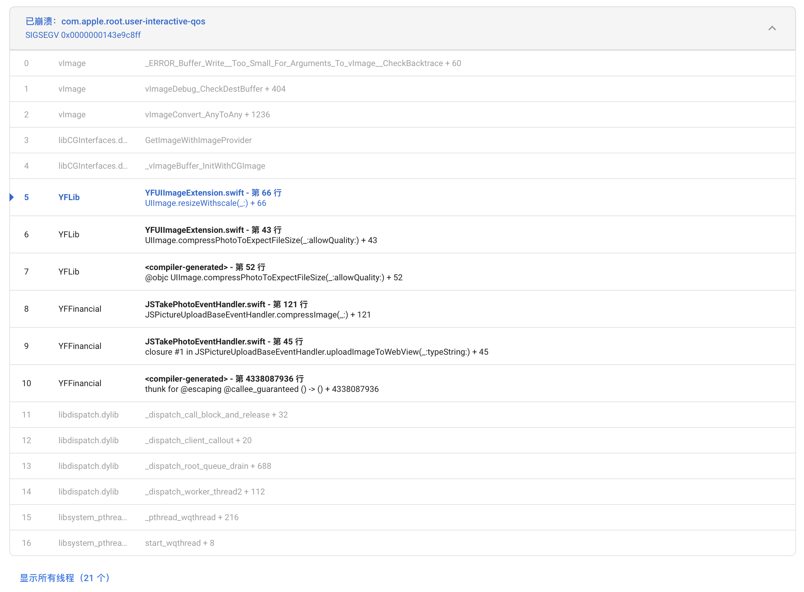
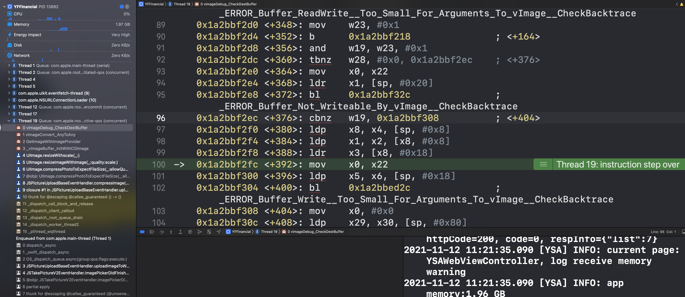
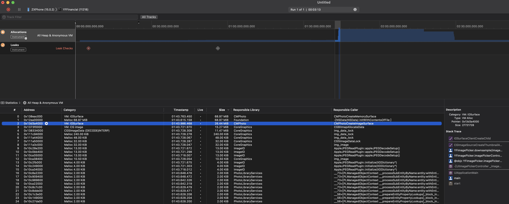
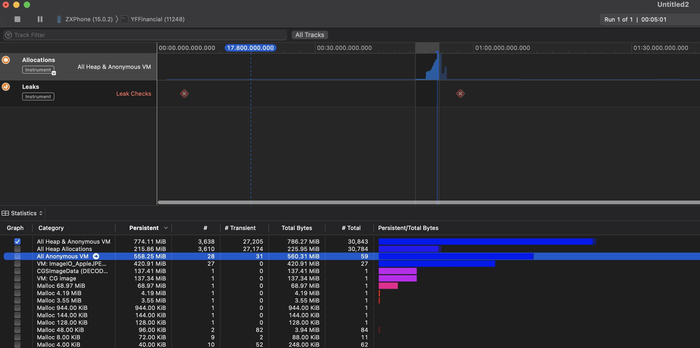
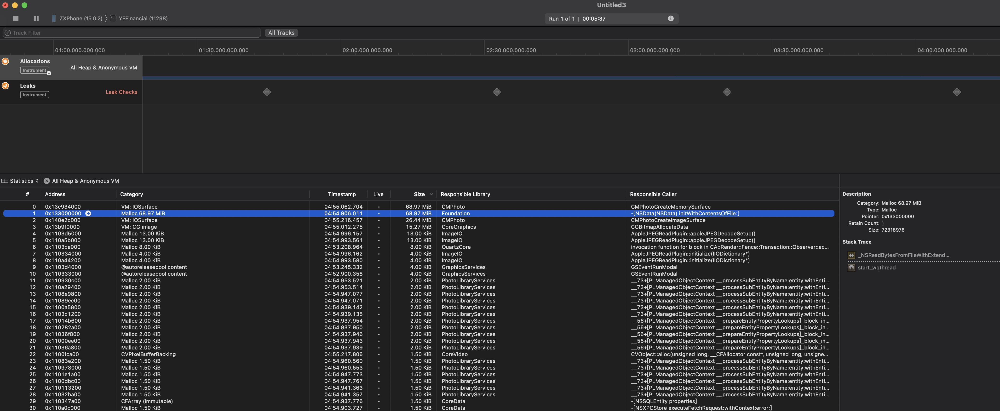

# 加载图片栈溢出Bug定位

从上图看到，崩溃在子线程，信号SIGSEGV（段违例）内存问题。
一般查看堆栈会先从项目符号开始查，frame 5-10相关代码逻辑查阅都未发现问题，只能继续往下找理解vImage相关API _vImageBuffer_InitWithCGImage以及_ERROR_Buffer_Write__Too_Small_For_Arguments_To_vImage__CheckBacktrace异常提示。
通过符号断点vImageDebug_CheckDestBuffer函数，上述异常逻辑在此函数中。

### 尝试复现
1. 借鉴大法，通过stackoverflow、apple developer forums、google检索崩溃原因。（推荐）
2. 推理法，通过推理，传入不同参数尝试复现崩溃。
3. 源码分析法，找到源码查看相应逻辑；闭源库通过IDA反编译工具尝试理解。有汇编基础的通过分析上图汇编代码找到崩溃原因。

最后通过借鉴大法，https://developer.apple.com/forums/thread/115259
崩溃原因：加载图片150M+图片太大，vImageBuffer_Init拷贝时超出限制导致缓冲区大小vImageBuffer < imageData，产生_ERROR_Buffer_Write__Too_Small_For_Arguments_To_vImage__CheckBacktrace异常。

### 关于iOS图像处理优秀文章
图片处理方案：
1. UIGraphicsImageRenderer （存在问题，内存峰值问题，）
2. Core Graphics Context
3. Image I/O
4. Core Image
5. vImage

| Technique | Time(seconds) |
| --- | --- |
| UIKit | 0.1420 |  
| Core Graphics | 0.1722 |  
| Image I/O | 0.1616 |  
| Core Image | 2.4983 |  
| vImage | 2.3126 |  

使用ImageIO处理共一张jpeg78MB格式压缩后的图片

> 截图内存占用长时间为调试原因导致，实际峰值内存很快就释放了。

使用UIKit UIGraphicsImageRenderer处理同一张图片

UIGraphicsImageRenderer产生的峰值内存较高。此API直接加载UIImage对象，并非通过CGImageSourceRef加载图片资源，导致有重复内存消耗。

使用Core Graphics与ImageIO内存峰值差异不大。ImageIO多了img_data_lock 11MB消耗。

可见对于简单图片处理，UIKit、Core Graphics、Image I/O性能都不错，但是底层API Core Image、vImage表现缺不佳

> 总结：建议使用Core Graphics或ImageIO。

https://nshipster.com/image-resizing/
https://devstreaming-cdn.apple.com/videos/wwdc/2018/219mybpx95zm9x/219/219_image_and_graphics_best_practices.pdf?dl=1