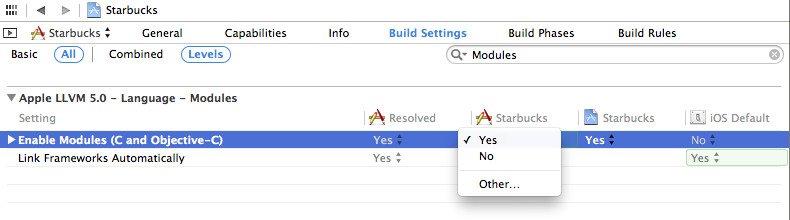

# swift-OC混合项目迁移Swift Static Libraries
xcode9之前，swift源代码不能打包成静态库，并且Cocoapods 1.5.0后，支持swift静态库，1.6.0版本进行了优化修复。
https://blog.cocoapods.org/CocoaPods-1.5.0/

迁移需要的调整：
1. Podfile屏蔽`use_framework!`，换成`use_modular_headers! `。或者给含有swift源文件的库添加`:modular_headers => true`
2. 调整导入方式，#import<xxx/xxx-Swift.h>需调整为@import xxx.Swift（预处理器有自动转译#import、#include为@import的功能，但是Swift这块不支持）。
3. xxx-Bridging-Header冲突调整。
4. 对于swift/oc混编的私有库，私有库内oc调用swift代码调整方案：
```
// 兼容swift static library以及framework接入方式
#if __has_include("xxx-Swift.h")
#import "xxx-Swift.h"
#else
#import <xxx/xxx-Swift.h>
#endif
```

## 预备知识点：llvm Modules
`import`解决`include`存在的一些不足：
* 编译时可伸缩性：每次包含头时，编译器都必须以传递方式预处理和解析该头及其包含的每个头中的文本。这个过程必须对应用程序中的每个翻译单元重复，这涉及到大量的冗余工作。在每个翻译单元中包含N个翻译单元和M个头的项目中，编译器执行M x N工作，即使大多数M个头在多个翻译单元之间共享。C++特别糟糕，因为模板的编译模型迫使大量代码进入头。
* 脆弱性：#include指令被预处理器视为文本包含，因此在包含时受任何活动宏定义的约束。如果任何活动宏定义与库中的名称发生冲突，则可能会破坏库API或导致库头本身的编译失败。对于一个极端的例子，`#define std "The C++ Standard" `，然后包含标准库头：结果是C++标准库实现中的一系列可怕的失败。当两个不同库的头文件由于宏冲突而交互时，会出现更微妙的实际问题，用户被迫重新排序`#include`指令或引入`#undef`指令以打破不合预期的依赖关系。
* 传统的解决方法：C程序员采用了许多约定来解决C预处理器模型的脆弱性。例如，大多数头文件都需要包含保护，以确保多重包含不会破坏编译。宏名称使用长前缀大写标识符编写，以避免冲突，一些库/框架开发人员甚至在头中使用带下划线的名称，以避免与（按照惯例）不应该是宏的“普通”名称发生冲突。这些约定是来自非C语言的开发人员进入的障碍，是经验丰富的开发人员的样板，并且使我们的headers比它们应该的要难看得多。
* 工具混淆：在基于C的语言中，很难构建与软件库配合良好的工具，因为库的边界不明确。哪些头属于特定的库，以及应该以什么顺序包含这些头以保证它们正确编译？标题是C、C++、Objul-C++，还是这些语言的变体之一？这些头文件中的哪些声明实际上是API的一部分，哪些声明仅因为必须作为头文件的一部分编写而存在？

llvm Modules解决以上问题，因此也产生了`import`指令。

### import与include的区别
`import`解决以下问题：
* 编译时可伸缩性：std.io模块只编译一次，将模块导入翻译单元是一个恒定时间操作（独立于模块系统）。因此，每个软件库的API只解析一次，从而将M x N复杂度简化为M+N。
* 脆弱性：每个模块都被解析为一个独立的实体，因此它有一个一致的预处理器环境。这完全消除了使用带下划线的名字和类似的防御技巧的需要。此外，当遇到导入声明时，会忽略当前的预处理器定义，因此一个软件库不能影响另一个软件库的编译方式，从而消除包含顺序依赖关系。
* 工具混淆：模块描述软件库的API，工具可以推理并将模块表示为该API。因为模块只能独立构建，所以工具可以依赖模块定义来确保获得库的完整API。此外，模块可以指定他们使用哪些语言，因此，例如，人们可以不意外地尝试将C++模块加载到C程序中。

### Objective-C Import 声明
在OC使用`@import declaration`语法来导入module。
使用`@import std.io`点语法来访问特定的submodule。

### Includes as imports
新版编译器会将include自动转换为import

### 使用Module更多细节请查看文档
参考文档：https://clang.llvm.org/docs/Modules.html#includes-as-imports


### #import 、 @import 、#include
`#import`用于导入动态库
`#include`为C预处理之灵
`@import`为llvm modules产物，为新的指令，解决上述问题。我们无需将代码里#import、#include改成@import，开启以下配置，预处理器会进行自动转译。


预编译导入指令发展历程：#include -> #import -> pch -> @import Module(oc) -> @import Module(swift)


