# Git分支管理模型-操作流程

## 支持分支
### 1.feature分支
开发期间根据需求文档创建feature分支。feature分支要求对需求合理拆分，不能太细也不能太泛。
#### 1.1.命名规范
1. 有Ticket编号:
feature/版本号/Jira的Ticket编号_需求描述_开发人员，注意要驼峰命名法。

2. 没有Ticket编号:
feature/版本号/Task_需求描述_开发人员

3. 重构:
feature/Remake/Remake_重构模块描述_开发人员

**注意：jira编号用下划线分割**

案例：
1. SMMART项目1.0需求，jira编号SMMART-718，开发人员：Paul。
`feature/1.0/SMMART_718_SignBillsTab_Paul`

1. SMMART项目1.0，修复单元测试问题，开发人员：Paul。
`feature/1.0/Task_UnitTestFix_Paul`

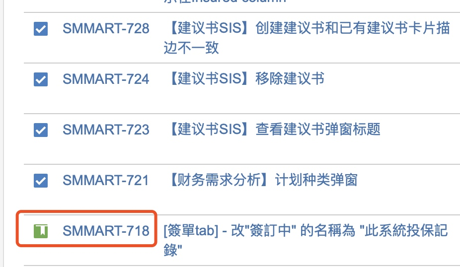

#### 1.2.feature分支创建
源分支：Develop
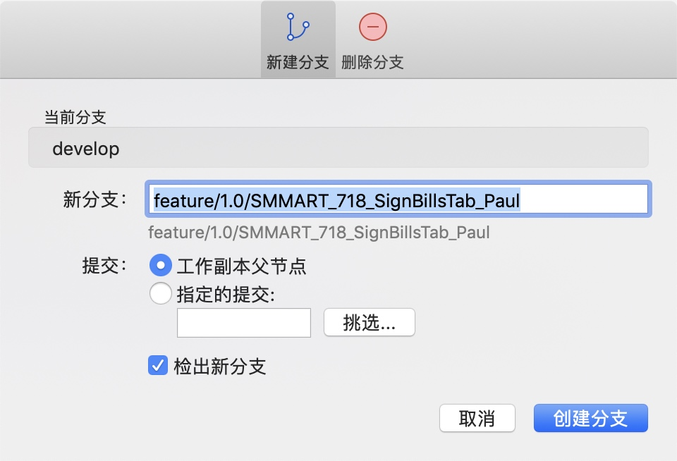


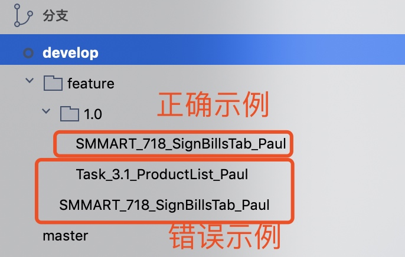


#### 1.3.feature分支合并:
Step1. 拉取develop分支
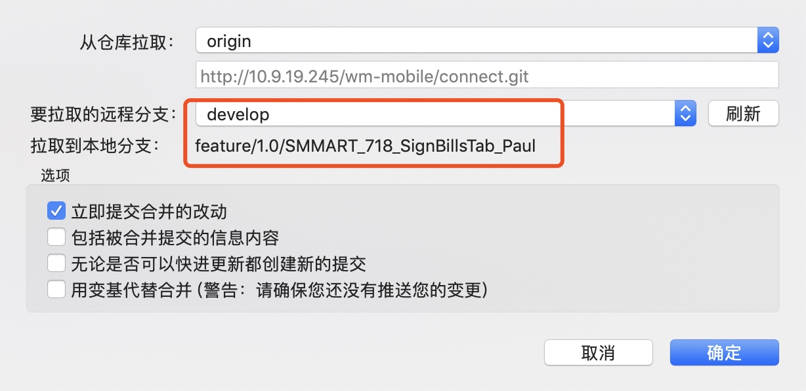


Step2. 申请合并。
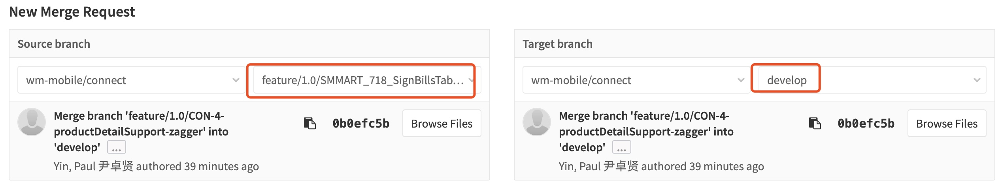


***保持现在的工作方式：
feature完成了部分特征即可合并到develop，以便code review工作。***
 **合并到develop需要保证以下2点：**
1、保证develop的正确性，编译不能崩溃。
2、保证有review的价值，所提交的代码完成了部分完整的特征。

### 2.Release分支
QA阶段结束，进入Stage测试阶段，使用release分支灰度测试、提审。
#### 2.1.命名规范：
release/release_版本号

案例：connect项目1.0版本进入发挥阶段。
分支名： `release/release_1.0`

#### 2.2.release分支创建
源分支： develop
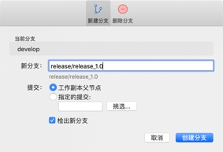
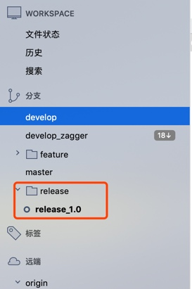

Release分支标志1.0版本迭代封代码了，这阶段要检查APP元数据是否更新，如：APP版本号，接口版本号、icon图、启动图等等。 这也是APP上线最后的bug修复机会要十分重视。 如果产品在发布阶段有要改的需求，我们可以以此拒绝（发布前几天改需求，是个大问题，要追溯问题的源头）。

打包送审都用release分支，因为有应用商店审核被拒，还需要修改的情况。

#### 2.3.release分支合并:
审核通过发布后，有2个必要步骤：
Step1. release分支同步代码至master分支并标记版本
Step2. release分支同步代码至develop分支
为了保险起见，建议2个主要分支的写权限交由专人管理。
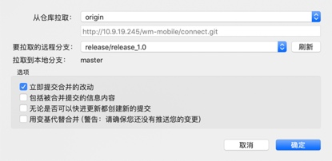

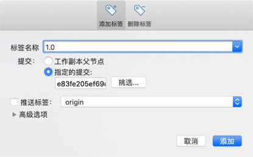
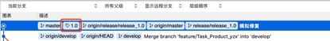

### 3.hotfix分支
一般有2种使用hotfix的场景：
1. 进发布阶段后的代码修改。
2. APP线上问题解决并发布。

#### 3.1.命名规范
hotfix/版本号/Jira的Ticket编号_描述_开发人员

场景1
案例：1.0版本上线后，消息中心崩溃Bug急需修复，jira编号Connect-99，修复后发布1.0.1版本。
分支名：`hotfix/1.0/hotfix_CONNECT_99_MsgCenterBug_Paul`
源分支：`release/release_1.0`

#### 3.2.hotfix分支创建
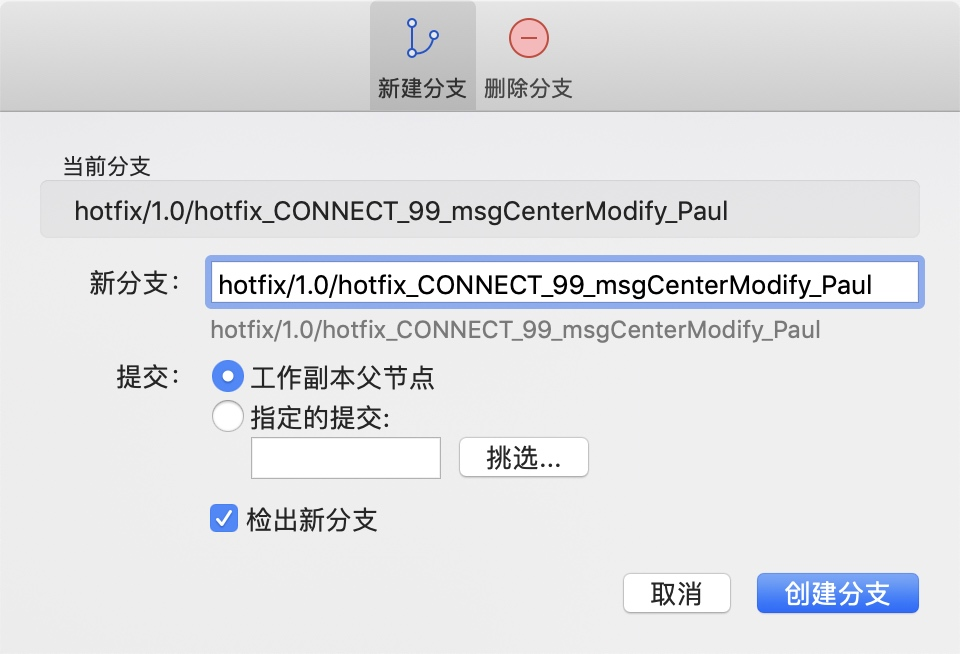


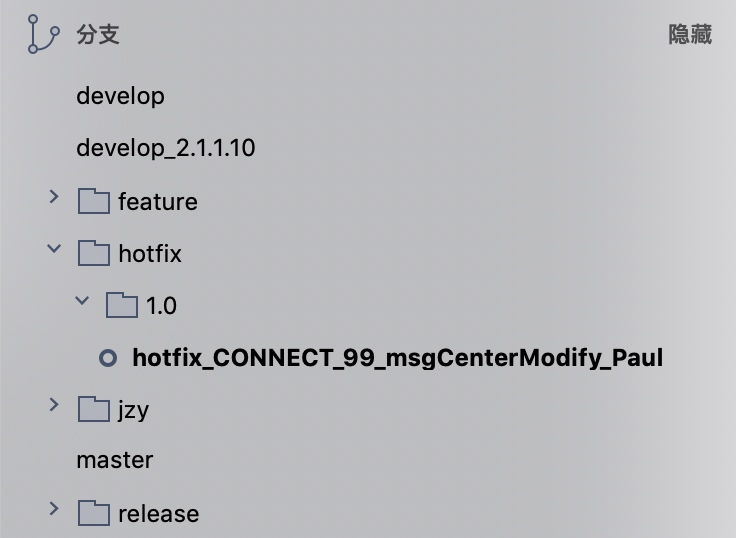


#### 3.3.hotfix分支合并
修复完成后合并回源分支：release/release_1.0。
并继续stage流程：测试-提审-上架-同步到主要分支。


---------------------------------------------
场景2.同理
案例：1.0版本在发布阶段消息中心模块产品突发性需求调整。
分支名：`hotfix/1.0/hotfix_MsgCenterModify_Paul`
源分支：`release/release_1.0`

修复完成后合并回源分支：`release/release_1.0`
并继续stage流程：测试-提审-上架-同步到主要分支。

## 同一代码库的多个项目管理。
案例：股票项目的分支项目：佳兆业
分支命名规范：
```
jzy/jzy_master
jzy/jzy_develop
jzy/feature/1.0/JZY_12_projectConvert_Paul
jzy/hotfix/1.0/hotfix_JZY_99_fixbug_Paul
jzy/release/jzy_release_1.0
```
基于master分支某个tag创建佳兆业的master、develop主要分支，其他支持分支同理创建。

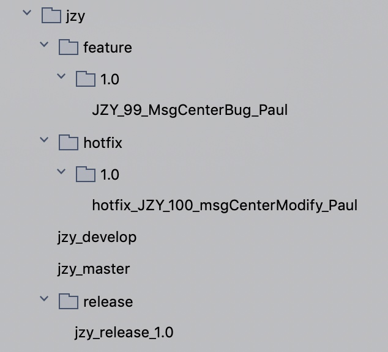

## 主要分支：master、develop操作略（只同步不修改）。

参考文档：https://nvie.com/posts/a-successful-git-branching-model/ 

## 版本插队、版本超前情况

案例：股票项目正在开发2.1.2版本，天降2.1.1.10插队版本。
基于master最新tag分支出develop_2.1.1.10分支。
基于develop_2.1.1.10创建feature和release分支，发布后同理将插队版本代码同步至develop和master，最后删除develop_2.1.1.10分支。

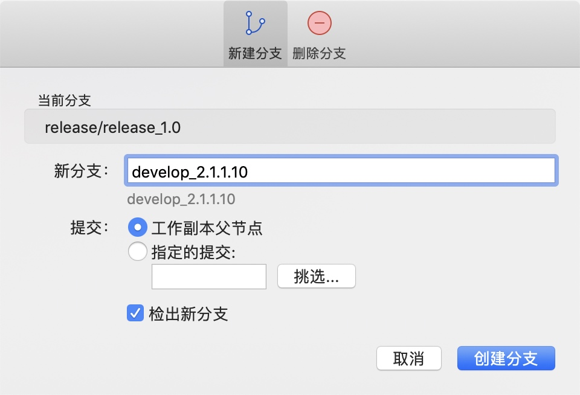
此时2.1.2版本可以同步开发。

版本超前情况同理

# 思考：
1. feature合并到develop的节点是feature完成的节点；CodeReview的粒度比feature完成的粒度细。feature还没并到develop的时，怎么进行CodeReview工作？
解决方案：
保持现有的工作方式，feature可经常合并develop进行code review。
 **合并到develop需要保证以下2点：**
1、保证develop的正确性，编译不能崩溃。
2、保证有review的价值，所提交的代码完成了部分完整的特征。


# Tips:
1. 当前feature分支申请合并状态（未codereview），同时，需要继续开发。
    继续在当前feature分支开发，若上次提交需要修改，使用贮藏功能。