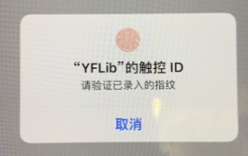
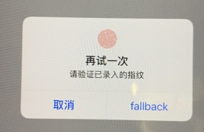
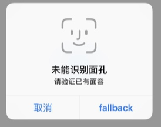

# 生物识别文档

##1.权限获取
###方法1
调用API：
func canEvaluatePolicy(_ policy: LAPolicy, error: NSErrorPointer) -> Bool
**有权限**：error为 `nil` 或者 返回值为 `true`
**无权限**：error非空 或者 返回值为 `false`
###方法2
直接调用识别API：
func evaluatePolicy(_ policy: LAPolicy, localizedReason: String, reply: @escaping (Bool, Error?) -> Void)
**有权限**：error为 `nil` 或者 返回值为 `true`
**无权限**：error非空 或者 返回值为 `false`

##2.错误码
###2.1.验证失败：
    kLAErrorAuthenticationFailed -1
只有指纹才有此错误，面容没有
###2.2.用户点击取消按钮
    kLAErrorUserCancel -2

###2.3.用户点击fallback按钮（此按钮可自定义）
    kLAErrorUserFallback -3
    
###2.4.系统取消
    kLAErrorSystemCancel -4
手机来电等情况

###2.5手机未设置密码，已设置生物识别
    kLAErrorPasscodeNotSet -5

###2.6手机生物识别可用（密码、生物识别均已设置），APP生物识别权限关闭：
    kLAErrorTouchIDNotAvailable/kLAErrorBiometryNotAvailable -6

###2.7手机已设置，手机生物识别未设置
    kLAErrorTouchIDNotEnrolled/kLAErrorBiometryNotEnrolled -7

###2.8手机生物识别可用，APP生物识别权限开启，错误次数过多导致生物识别被锁
    kLAErrorTouchIDLockout/kLAErrorBiometryLockout -8
    
###2.9.在验证中被其他app中断
    kLAErrorAppCancel -9
    
###2.10.context无效
    kLAErrorInvalidContext -10
代码错误，过早释放context

###2.11.APP非活动状态时调用识别
    LAErrorNotInteractive -1004
例如：applicationWillEnterForeground:
     application: didReceiveRemoteNotification:
生物识别需要展示UI，此时应用还在后台无法展示生物识别UI。

###错误码汇总
kLAErrorAuthenticationFailed -1
kLAErrorUserCancel -2
kLAErrorUserFallback
kLAErrorSystemCancel
kLAErrorPasscodeNotSet
kLAErrorTouchIDNotAvailable
kLAErrorTouchIDNotEnrolled
kLAErrorTouchIDLockout
kLAErrorAppCancel
kLAErrorInvalidContext
kLAErrorNotInteractive
kLAErrorBiometryNotAvailable
kLAErrorBiometryNotEnrolled
kLAErrorBiometryLockout

##3.指纹与面容差别
###3.1.验证失败的回调 kLAErrorAuthenticationFailed 只有指纹有
    
###3.2.指纹错误5次后生物识别会lockout；面容错误次数没有明确的数字，但也会lockout。

###3.3.UI和交互不一样。
TouchID: 开始没有fallback按钮,错误一次后展示fallback按钮
FaceID: 开始没有fallback按钮,多了再次尝试中间页（中间页不可定制任何东西）,错误2次展示与指纹类似的页面。

##4.生物识别更改校验（iOS 9及以上）
校验`evaluatedPolicyDomainState`与缓存是否一致

##5.流程
###5.1.校验生物识别更改（若需）
使用缓存`cacheState`
case1: cacheState == nil 未开启
case2: cacheState == evaluatedPolicyDomainState 开启可用
case3: cacheState != evaluatedPolicyDomainState 开启有变更,将cacheState置空让用户重新开启。

###5.2.调用生物识别
直接调用生物识别API：
`func evaluatePolicy(_ policy: LAPolicy, localizedReason: String, reply: @escaping (Bool, Error?) -> Void)`

###5.3.生物识别业务处理
####5.3.1.返回`true`,执行成功业务
####5.3.2.返回`false`,处理error分3种： 
1.`kLAErrorUserCancel、kLAErrorSystemCancel、kLAErrorAppCancel`
cancel类：不处理
2.`kLAErrorPasscodeNotSet、kLAErrorTouchIDNotAvailable、kLAErrorTouchIDNotEnrolled`
权限类，引导用户到**设置**开启
3.`kLAErrorTouchIDLockout、kLAErrorBiometryLockout`
被锁执行**解锁流程**

####5.4.回调处理
1.验证失败`kLAErrorAuthenticationFailed`
只有指纹有此回调，一般需要APP写弹窗提示
2.点击fallback按钮`kLAErrorUserFallback`
执行自定义的fallback业务

